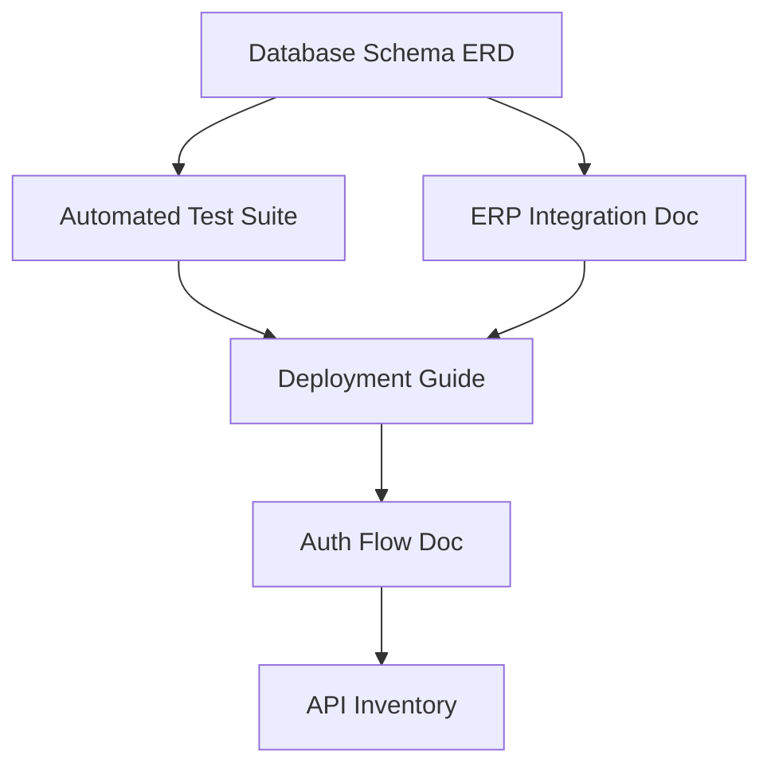

# Recommendations: Next Steps for Project Improvement

> [!NOTE]
> This document outlines recommended improvements based on the analysis of the current project state. Items are prioritized by impact and urgency.

## High Priority (Security & Stability)

### 1. Automated Test Suite
- **Status**: Not implemented
- **Why**: Risk #8 in PROJECT_CONTEXT.md — refactoring is high-risk without tests.
- **Scope**:
  - Integration tests for `bp_contracts` (contract creation, WebSocket events)
  - Integration tests for `bp_zakazi` (order sync with `temporary_*` tables)
  - Unit tests for `wordpress_framework` Workers
- **Tooling**: PHPUnit + WP Test Framework
- **Estimate**: 1-2 Weeks for critical paths

### 2. ERP Integration Documentation
- **Status**: Undocumented
- **Why**: Risk #9 — `UPWorker` syncs with external ERP silently; failures go unnoticed.
- **Deliverable**: `ERP_INTEGRATION.md` documenting:
  - API endpoints and authentication
  - Data flow diagrams
  - Error handling and monitoring
- **Estimate**: 2-3 Days

### 3. Database Schema ERD
- **Status**: Not documented
- **Why**: Risk #2 — 40+ `gi_*` tables with no visual representation.
- **Deliverable**: `DATABASE_SCHEMA.md` with:
  - Mermaid ERD diagrams
  - Table relationships
  - Key indexes and constraints
- **Estimate**: 3-5 Days

---

## Medium Priority (Documentation)

### 4. Deployment & Operations Guide
- **Status**: Not documented
- **Why**: WebSocket process supervision, backup procedures, and server requirements are unclear.
- **Deliverable**: `OPERATIONS.md` covering:
  - WebSocket process management (supervisor config)
  - Backup and restore procedures
  - Monitoring and alerting setup
- **Estimate**: 1-2 Days

### 5. Authentication Flow Documentation
- **Status**: Not documented
- **Why**: Risk #5 — dual auth systems (`gi_new_users` vs WP Users) create confusion.
- **Deliverable**: Flowchart in `AUTH_FLOW.md` showing:
  - Login flows for dealers vs admins
  - Session handling
  - Token/cookie management
- **Estimate**: 1 Day

### 6. API Endpoints Inventory
- **Status**: Not documented
- **Why**: `bp_contracts` and other plugins expose AJAX/REST endpoints with unknown security posture.
- **Deliverable**: `API_INVENTORY.md` listing:
  - All AJAX actions
  - Required capabilities/permissions
  - Input validation status
- **Estimate**: 2-3 Days

---

## Nice to Have (Enhancements)

### 7. Plugin Dependency Graph
- **Why**: Clarifies which plugins depend on `wordpress_framework` and each other.
- **Deliverable**: Mermaid diagram in PROJECT_CONTEXT.md or separate file.
- **Estimate**: 2-4 Hours

### 8. CHANGELOG Integration
- **Why**: Link existing CHANGELOG.md to PROJECT_CONTEXT.md for complete documentation loop.
- **Estimate**: 30 Minutes

---

## Implementation Order

> [!IMPORTANT]
> **Recommended Starting Point**: Database Schema ERD — it unblocks understanding for tests, ERP docs, and auth flows.
